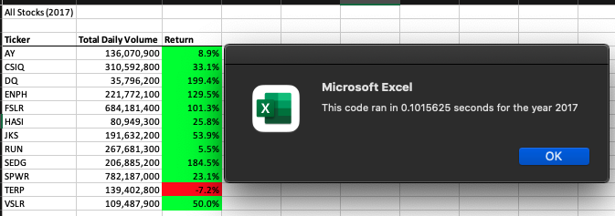
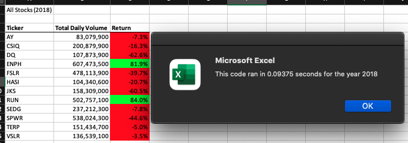

# Stocks-analysis
Analysis on green stocks in year 2017 & 2018. 

## Overview of Project: Exaplain the purpose of this analysis. 
### General Overview.
The purpose of this analysis is to provide insight on how well each green stocks performed in the year of 2017 & 2018.  
With history records of green stocks in these years, analysis showcases the total daily volumes and return rates (if held from day 1 to day 365 without selling) for each green stocks in specific year.  
Along with supporting images below, potential investors would understand the past performance of each green stock in a glance. 

## Results: Using images and examples of your code, compare the stock performance between 2017 and 2018, as well as the execution times of the original script and the refactored script
### Image & Code Demonstration.

#### Green stock performance in 2017
Image below shows that majority of the green stocks in year 2017 had positive return rates, showing in green cells. These returns ranges from the minimum of 5.5% to maximum of 199.4%. This suggests that year 2017 was a definitely a good year to invest in green stocks.  
The stock, which had a poor performance of negative return rate, was "TERP". (For further information or reasoning regarding this stock's negative return rate, a further research is required.)  
<u><b>Total time for code run: <i> ~0.102 </i></b></u>
  
  
#### Green stock performance in 2018 
Despite all the oustanding performances in 2017, the following year was definitely not an investing year for green stocks. Out of 12 from previous year, only 2 green stocks remained positive return rates in year 2018 - "ENPH" and "RUN".  
<u><b>Total time for code run: <i> ~0.094 </i></b></u>

#### Code - VBA
    Sub AllStocksAnalysisRefactored()
    Dim startTime As Single
    Dim endTime  As Single

    yearValue = InputBox("What year would you like to run the analysis on?")

    startTime = Timer
    
    'Format the output sheet on All Stocks Analysis worksheet
    Worksheets("All Stocks Analysis").Activate
    
    Range("A1").Value = "All Stocks (" + yearValue + ")"
    
    'Create a header row
    Cells(3, 1).Value = "Ticker"
    Cells(3, 2).Value = "Total Daily Volume"
    Cells(3, 3).Value = "Return"

    'Initialize array of all tickers
    Dim tickers(12) As String
    
    tickers(0) = "AY"
    tickers(1) = "CSIQ"
    tickers(2) = "DQ"
    tickers(3) = "ENPH"
    tickers(4) = "FSLR"
    tickers(5) = "HASI"
    tickers(6) = "JKS"
    tickers(7) = "RUN"
    tickers(8) = "SEDG"
    tickers(9) = "SPWR"
    tickers(10) = "TERP"
    tickers(11) = "VSLR"
    
    'Activate data worksheet
    Worksheets(yearValue).Activate
    
    'Get the number of rows to loop over
    RowCount = Cells(Rows.Count, "A").End(xlUp).Row
    
    '1a) Create a ticker Index
    tickerIndex = 0

    '1b) Create three output arrays (**unsure the number of element needed thus setting as 12)
    Dim tickerVolumes(12) As Long
    Dim tickerStartingPrices(12) As Single
    Dim tickerEndingPrices(12) As Single
    
    
    '2a) Create a for loop to initialize the tickerVolumes to zero. (**setting all elements in tickerVolumes to zero)
    For j = 0 To 11
   
        tickerVolumes(i) = 0
    
    Next j
        
    '2b) Loop over all the rows in the spreadsheet.
    For i = 2 To RowCount
        
        '3a) Increase volume for current ticker
        tickerVolumes(tickerIndex) = tickerVolumes(tickerIndex) + Cells(i, 8).Value
       
        '3b) Check if the current row is the first row with the selected tickerIndex.
        If Cells(i, 1).Value = tickers(tickerIndex) And Cells(i - 1, 1).Value <> tickers(tickerIndex) Then
        
            tickerStartingPrices(tickerIndex) = Cells(i, 6).Value
            
        End If
        
        '3c) check if the current row is the last row with the selected ticker
         'If the next row’s ticker doesn’t match, increase the tickerIndex.
        If Cells(i, 1).Value = tickers(tickerIndex) And Cells(i + 1, 1).Value <> tickers(tickerIndex) Then
        
            tickerEndingPrices(tickerIndex) = Cells(i, 6).Value

         '3d Increase the tickerIndex.
                tickerIndex = tickerIndex + 1
        End If
    
    Next i
    
    '4) Loop through your arrays to output the Ticker, Total Daily Volume, and Return.
    For i = 0 To 11
        
        Worksheets("All Stocks Analysis").Activate
        Cells(i + 4, 1).Value = tickers(i)
        Cells(i + 4, 2).Value = tickerVolumes(i)
        Cells(i + 4, 3).Value = tickerEndingPrices(i) / tickerStartingPrices(i) - 1
        
    Next i
    
    'Formatting
    Worksheets("All Stocks Analysis").Activate
    Range("A3:C3").Font.FontStyle = "Bold"
    Range("A3:C3").Borders(xlEdgeBottom).LineStyle = xlContinuous
    Range("B4:B15").NumberFormat = "#,##0"
    Range("C4:C15").NumberFormat = "0.0%"
    Columns("B").AutoFit

    dataRowStart = 4
    dataRowEnd = 15

    For i = dataRowStart To dataRowEnd
        
        If Cells(i, 3) > 0 Then
            
            Cells(i, 3).Interior.Color = vbGreen
            
        Else
        
            Cells(i, 3).Interior.Color = vbRed
            
        End If
        
    Next i
 
    endTime = Timer
    MsgBox "This code ran in " & (endTime - startTime) & " seconds for the year " & (yearValue)
    End Sub

## Summary: In a summary statement, address the following questions
### Brief Conclusion.
- What are the advantages or disadvantages of refactoring code?
  - Advatanges: It seems like with refactoring codes, the code can be re-used in a borader area, and is easier to expend analysis. Assuming a bigger data needs to be analyzed, all we need to do is adding new ticker names, and extend the numbers in each arrays that holds elements in order for codes to run through the new added data.
  - Disadvantages: This requires a view from a higher perspective because this does not deal with one specific stock, but tons. Thus, refractoring code definitely requires more time just so that the codes could be well structured, organized, and easy to access. This also needs a lot of brainpower because there are multiple variables, interations, and arrays that needs to be tracked and monitored when coding. 

- How do these pros and cons apply to refactoring the original VB script?
   - The original VB script offers a shallower point of view. But with the originals, I was able to mirror and further develop codes into a deeper level that captures all the data from the reports with more efficient timing. There was a lot of times spent on debugging though. It took me approximately 1.5 hours to finally figure out the reason my analysis was not populating the correct numebr. The code was supposed to be Cells(i + 1, <u>1</u>).Value, but I accidently typed Cells(i + 1, <u>i</u>).Value and the return rates were showing 100% for all stocks. I had to go into line by line in ordeer to locate the error. (I guess this is the fun part!)
 

